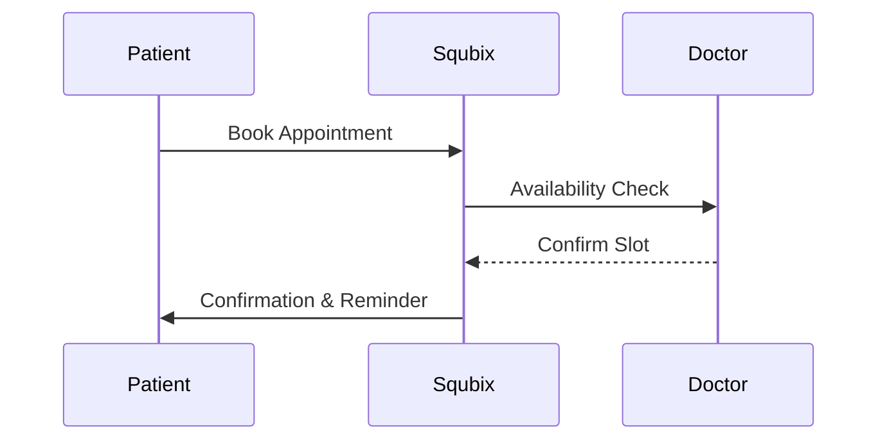

## Overview

Squbix provides essential tools to manage healthcare operations efficiently. You handle patient data securely, maintain electronic medical records, process billing, and schedule appointments seamlessly. These features integrate to support clinical workflows and administrative tasks.

<Columns cols={2}>
  <Card title="Patient Management" icon="users" href="#patient-management">
    Securely store and access patient profiles with full audit trails.
  </Card>
  <Card title="Medical Records" icon="file-text" href="#medical-records">
    Digitize and update records with version history.
  </Card>
  <Card title="Billing Tools" icon="dollar-sign" href="#billing">
    Generate invoices and financial reports automatically.
  </Card>
  <Card title="Scheduling" icon="calendar" href="#scheduling">
    Book and manage appointments across providers.
  </Card>
</Columns>

## Patient Data Management

You manage patient information through intuitive workflows. Start by creating profiles via the dashboard or API.

<Steps>
  <Step title="Create Patient Profile" icon="user-plus">
    Use the API to register new patients.

    <CodeGroup tabs="JavaScript,Python">
      ```javascript
      const response = await fetch('https://api.example.com/v1/patients', {
        method: 'POST',
        headers: { 'Authorization': 'Bearer YOUR_API_KEY', 'Content-Type': 'application/json' },
        body: JSON.stringify({
          firstName: 'Jane',
          lastName: 'Doe',
          dateOfBirth: '1980-05-15',
          email: 'jane.doe@example.com'
        })
      });
      ```
      ```python
      import requests
      response = requests.post(
        'https://api.example.com/v1/patients',
        headers={'Authorization': 'Bearer YOUR_API_KEY', 'Content-Type': 'application/json'},
        json={
          'firstName': 'Jane',
          'lastName': 'Doe',
          'dateOfBirth': '1980-05-15',
          'email': 'jane.doe@example.com'
        }
      )
      ```
    </CodeGroup>
  </Step>
  <Step title="Update Details" icon="edit">
    Modify records with change logging for compliance.
  </Step>
  <Step title="Search Records" icon="search">
    Query by name, ID, or demographics.
  </Step>
</Steps>

<Callout kind="tip">
  Always use HTTPS and encrypt sensitive data like `{dateOfBirth}` in transit.
</Callout>

## Electronic Medical Records

Access and update records electronically. Squbix tracks changes with timestamps and user attribution.

<ParamField path="patientId" param-type="string" required="true">
  Unique patient identifier from `/v1/patients`.
</ParamField>

<ParamField body="notes" param-type="string" required="false">
  Clinical observations and updates.
</ParamField>

You retrieve records like this:

<Request tabs="JavaScript,cURL">
  ```javascript
  const records = await fetch(`https://api.example.com/v1/patients/{patientId}/records`, {
    headers: { 'Authorization': 'Bearer YOUR_API_KEY' }
  });
  ```
  ```bash
  curl -H "Authorization: Bearer YOUR_API_KEY" \
    "https://api.example.com/v1/patients/{patientId}/records"
  ```
</Request>

## Billing and Financial Reporting

Generate invoices and reports directly from patient visits. Automate claims submission.

| Report Type | Description | Frequency |
|-------------|-------------|-----------|
| Monthly Invoices | Patient billing summaries | End of month |
| Insurance Claims | Standardized EDI 837 format | Per visit |
| Revenue Analytics | Charts and trends | Real-time |

<Tabs>
  <Tab title="Invoice Generation" icon="file-dollar">
    Create bills post-appointment.

    ```javascript
    await fetch('https://api.example.com/v1/billing/invoices', {
      method: 'POST',
      body: JSON.stringify({ patientId: 'pt_123', amount: 150.00 })
    });
    ```
  </Tab>
  <Tab title="Export Reports" icon="download">
    Download CSV or PDF formats.
  </Tab>
</Tabs>

## Scheduling and Appointment Management

Book appointments across providers and locations. View calendars and send reminders.



<Expandable title="Advanced Scheduling Options" default-open="false">
  Integrate with external calendars or set recurring visits.

  Use query parameters for filters:

  <ParamField query="providerId" param-type="string">
    Filter by doctor ID.
  </ParamField>

  <ParamField query="dateFrom" param-type="date">
    Start date for searches.
  </ParamField>
</Expandable>

<Callout kind="success">
  Squbix ensures HIPAA-compliant handling of all patient data.
</Callout>