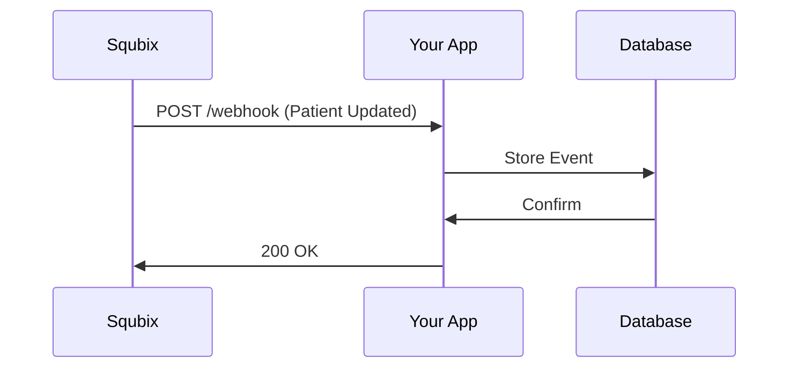

## Overview

Squbix supports seamless integrations with electronic health record (EHR) systems, laboratory information systems (LIS), payment gateways, and custom APIs. You configure these integrations through the Squbix dashboard to automate patient data exchange, process payments securely, and receive real-time notifications via webhooks. This guide walks you through setup for each integration type.

<Callout kind="info">
  Access integrations in your Squbix dashboard at `https://dashboard.example.com/integrations`. Ensure you have admin permissions before proceeding.
</Callout>

## Available Integrations

Explore key integration categories to extend Squbix functionality.

<Columns cols={2}>
  <Card title="EHR & Lab Systems" icon="database" href="#ehr-lab">
    Sync patient records and lab results with FHIR-compliant systems like Epic or Cerner.
  </Card>
  <Card title="Payment Gateways" icon="credit-card" href="#payments">
    Accept payments securely via Stripe or PayPal for billing.
  </Card>
  <Card title="Webhooks" icon="zap" href="#webhooks">
    Receive real-time events for patient admissions or appointment updates.
  </Card>
  <Card title="Custom APIs" icon="code" href="#custom-api">
    Build advanced extensions using Squbix REST APIs.
  </Card>
</Columns>

## EHR and Lab System Integrations

Set up FHIR-based integrations for EHR and LIS to automate data flow.

<Steps>
  <Step title="Enable FHIR Endpoint" icon="settings">
    Navigate to Integrations > EHR in the dashboard. Toggle FHIR API access and note your endpoint URL: `https://api.example.com/fhir/patient`.
  </Step>
  <Step title="Configure OAuth" icon="lock">
    Generate client credentials. Use these in your EHR system's integration panel.
  </Step>
  <Step title="Test Sync" icon="play">
    Trigger a test patient sync. Verify data appears in Squbix patient records.
  </Step>
</Steps>

<ParamField path="patientId" param-type="string" required="true">
  Unique patient identifier from your EHR system.
</ParamField>

<ParamField header="Authorization" param-type="string" required="true">
  Bearer token for FHIR access.
</ParamField>

## Payment Gateway Connections

Connect popular gateways for streamlined billing.

<Tabs>
  <Tab title="Stripe" icon="dollar-sign">
    <Steps>
      <Step title="Get API Keys">
        Retrieve your Stripe secret key from the Stripe dashboard.
      </Step>
      <Step title="Add to Squbix">
        In Squbix Integrations > Payments, select Stripe and paste `sk_test_your-stripe-secret-key`.
      </Step>
    </Steps>

    <CodeGroup tabs="JavaScript,cURL">
    ````javascript
    const stripe = require('stripe')('sk_test_your-stripe-secret-key');
    const payment = await stripe.paymentIntents.create({
      amount: 2000,
      currency: 'usd',
      metadata: { patientId: 'PAT-12345' }
    });
    ````
    ````bash
    curl https://api.stripe.com/v1/payment_intents \
      -u sk_test_your-stripe-secret-key: \
      -d amount=2000 \
      -d currency=usd \
      -d "metadata[patientId]=PAT-12345"
    ````
    </CodeGroup>
  </Tab>
  <Tab title="PayPal" icon="paypal">
    Use PayPal's REST API for invoice payments. Enter your client ID and secret in Squbix settings.
  </Tab>
</Tabs>

## Webhook Configuration

Configure webhooks to push real-time events to your endpoint.

First, visualize the webhook flow:



<CodeGroup tabs="JavaScript,Python">
````javascript
app.post('/webhook', (req, res) => {
  const event = req.body;
  if (event.type === 'patient.admitted') {
    console.log(`Patient ${event.data.patientId} admitted`);
  }
  res.status(200).send('OK');
});
````
````python
from flask import Flask, request

app = Flask(__name__)

@app.route('/webhook', methods=['POST'])
def webhook():
    event = request.json
    if event['type'] == 'patient.admitted':
        print(f"Patient {event['data']['patientId']} admitted")
    return 'OK', 200
````
</CodeGroup>

In Squbix dashboard, add your webhook URL: `https://your-webhook-url.com/webhook` and select events like `patient.admitted`.

<Request tabs="JavaScript,cURL">
````javascript
fetch('https://api.example.com/webhooks', {
  method: 'POST',
  headers: { 'Authorization': 'Bearer YOUR_API_KEY' },
  body: JSON.stringify({
    url: 'https://your-webhook-url.com/webhook',
    events: ['patient.admitted', 'appointment.booked']
  })
});
````
````bash
curl -X POST https://api.example.com/webhooks \
  -H "Authorization: Bearer YOUR_API_KEY" \
  -H "Content-Type: application/json" \
  -d '{
    "url": "https://your-webhook-url.com/webhook",
    "events": ["patient.admitted", "appointment.booked"]
  }'
````
</Request>

<Response tabs="200">
```json
{
  "success": true,
  "webhookId": "wh_123abc"
}
```
</Response>

## Custom API Usage

For advanced extensions, use Squbix REST APIs directly.

<Callout kind="tip">
  Generate an API key in dashboard under API Access. Store it securely as `YOUR_API_KEY`.
</Callout>

Example: Retrieve patient data.

<Request show-lines="true">
```javascript
const response = await fetch('https://api.example.com/patients/PAT-12345', {
  headers: { 'Authorization': `Bearer ${YOUR_API_KEY}` }
});
const patient = await response.json();
```
</Request>

<Response>
```json
{
  "id": "PAT-12345",
  "name": "John Doe",
  "conditions": ["Hypertension"]
}
```
</Response>

<Expandable title="Advanced Filtering" default-open="false">
  Use query params for filtered searches:

  <ParamField query="condition" param-type="string">
    Filter by medical condition, e.g., `?condition=diabetes`.
  </ParamField>
</Expandable>