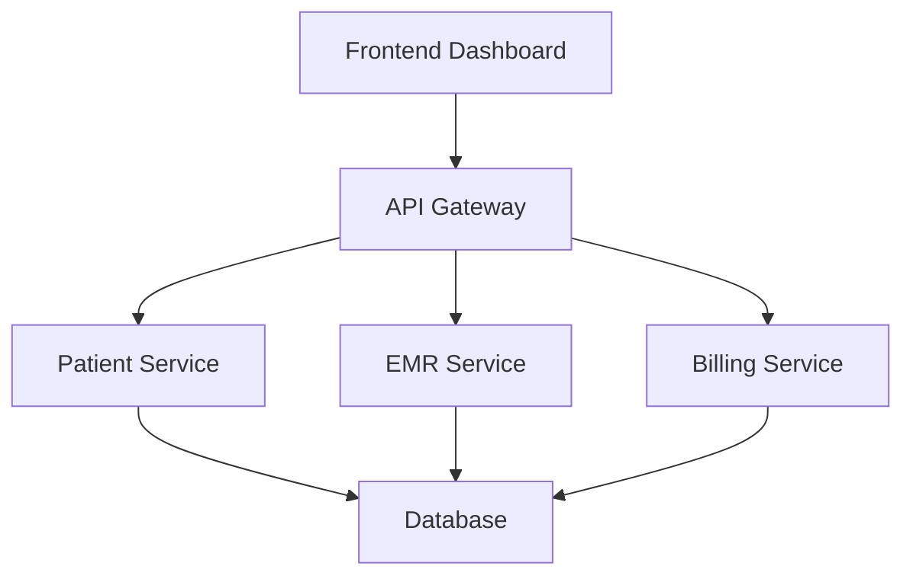

## Overview

Squbix Healthcare Information System empowers you to manage patient data, electronic medical records (EMR), and billing with ease. You streamline clinical workflows and administrative tasks, ensuring high-quality care and operational efficiency. Access real-time insights into patient histories, schedule appointments, and process claims seamlessly from a unified dashboard.

## Key Features

Squbix offers powerful tools tailored for healthcare providers. Explore the core capabilities below.

<Columns cols={3}>
  <Card title="Patient Management" icon="users" href="/docs/patient-management">
    Track patient profiles, appointments, and treatment histories in one secure place.
  </Card>
  <Card title="Electronic Medical Records" icon="file-text" href="/docs/emr">
    Store and retrieve detailed EMR with compliance to HIPAA standards.
  </Card>
  <Card title="Billing & Claims" icon="credit-card" href="/docs/billing">
    Automate invoicing, insurance claims, and payment tracking.
  </Card>
</Columns>

## Benefits for Your Practice

<Callout kind="success">
  Squbix reduces administrative overhead by `>40%`, allowing you to focus on patient care. You gain real-time analytics for better decision-making and improved outcomes.
</Callout>

You benefit from enhanced patient satisfaction through faster access to records and personalized care plans. Operational efficiency improves with automated workflows, minimizing errors in billing and scheduling.

## System Architecture

Squbix follows a scalable, cloud-native architecture. The following diagram illustrates the key components.



You interact via the responsive dashboard, which routes requests through the API gateway to microservices handling patients, EMR, and billing. All data persists in a secure database.

## Quick Start

Get up and running with Squbix in minutes.

<Steps>
  <Step title="Sign Up" icon="user-plus">
    Create your account at `https://dashboard.example.com/signup`. Provide your clinic details and verify your email.
  </Step>
  <Step title="Configure Settings" icon="settings">
    Access the admin panel and set up users, integrations, and compliance preferences.
  </Step>
  <Step title="Add First Patient" icon="plus">
    Navigate to Patients and import or create your first record.

````javascript
// Example: Fetch patient data via API
const response = await fetch('https://api.example.com/v1/patients/123', {
  headers: {
    'Authorization': `Bearer YOUR_API_KEY`
  }
});
const patient = await response.json();
console.log(patient);
````
  </Step>
  <Step title="Explore Dashboard" icon="activity">
    Review analytics and start scheduling appointments.
  </Step>
</Steps>

## Documentation Navigation

Dive deeper into Squbix with these guides.

<Columns cols={2}>
  <Card title="Quickstart" icon="rocket" href="/quickstart">
    Complete onboarding steps.
  </Card>
  <Card title="Authentication" icon="shield" href="/authentication">
    Secure your API access.
  </Card>
  <Card title="API Reference" icon="code" href="/api-reference">
    Integrate with Squbix APIs.
  </Card>
  <Card title="Changelog" icon="git-branch" href="/changelog">
    Track latest updates.
  </Card>
</Columns>

<Callout kind="tip">
  Begin with the Quickstart guide to integrate Squbix into your workflow today.
</Callout>